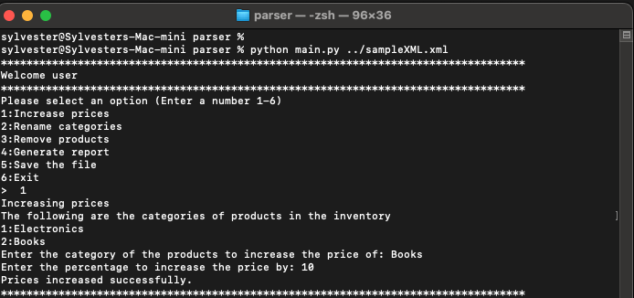
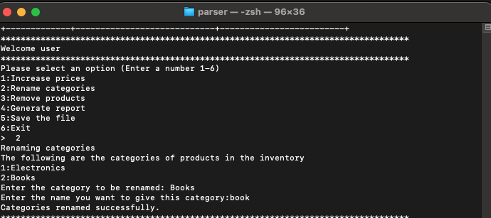
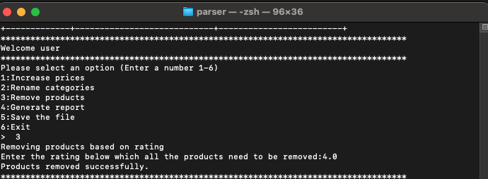
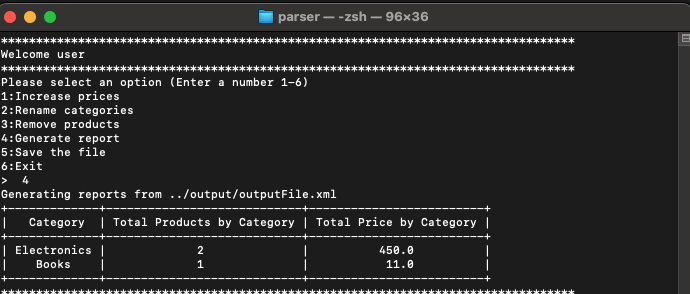
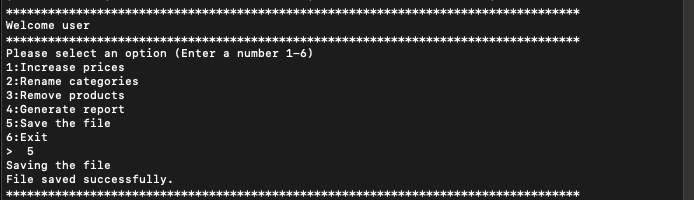
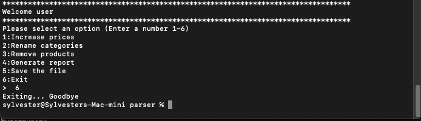

# pythonTestSolution-Sylvester

## Objective:
Create a Python tool that can parse an XML file containing product data, manipulate the data, save the results back into XML format, and generate reports.

## Instructions:

### Data Parsing:
- Load and parse the provided XML file.
- Extract relevant product data.

### Data Manipulation:
- Increase the price of products in a specific category by a user-defined percentage.
- Rename a specific category.
- Remove products below a user-defined rating.

### Saving the Changes:
- After making changes, save the updated data back to an XML file.

### User Interface:
- Design a simple CLI (Command Line Interface) for the user to input their choices and provide necessary information.

## Requirements:
- Implement basic error handling for invalid requests.
- Write unit tests covering the main functionality.
- Generate a report to display the total products by category and total price by category.


## Sample XML Data:
```xml
<products>
  <product category="Electronics">
    <name>Iphone 12 Pro</name> 
    <price>599.99</price> 
    <rating>4.5</rating>
  </product>
  <product category="Books">
    <name>Python for Beginners</name> 
    <price>29.99</price> 
    <rating>4.0</rating>
  </product>
  <product category="Electronics">
    <name>Ipod</name> 
    <price>49.99</price>
    <rating>3.9</rating>
  </product>
</products>
```


## Refer:
Refer the documentation folder for additional information

## Directory structure
- DirectoryStructure.md
- LICENSE
- README.md
- documentation
  - file_operations.md
  - main.md
  - menu.md
  - product_manipulation.md
  - utility_functions.md
  - xml_operations.md
- output
- requirements.txt
- screenshots
  - exit.png
  - generate_report.png
  - increase_prices.png
  - remove_product.png
  - renaming_categories.png
  - save_changes.png
- xmlparser
  - output
    - outputFile.xml
  - parser
    - __init__.py
    - file_operations.py
    - main.py
    - product_manipulation.py
    - user_interface.py
    - utility_functions.py
    - xml_operations.py
  - sampleXML.xml
  - tests
    - __init__.py
    - test_file_operations.py
    - test_product_manipulation.py
    - test_user_interface.py
    - test_utility_functions.py
    - test_xml_operations.py


## Note
- To run the pytests navigate to the tests folder and run
```bash
PYTHONPATH=parser pytest tests/
```
- To run test coverage navigate to xmlparser directory and run 
```bash
PYTHONPATH=parser pytest --cov=parser tests/
``` 
- A requirements.txt file is provided to be used to install dependencies for the project

### Usage
Navigate to the `parser` directory and run:

```bash
python main.py <filename.xml>
```
### Example usage
```bash
python main.py ../sampleXML.xml
```
### Screenshots













